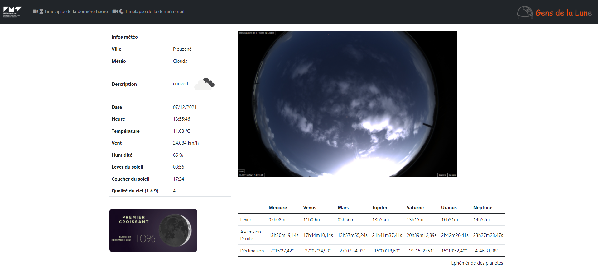

## Projet Skywatch

Ce projet a été mis en place pour apporter une source d'informations supplémentaires aux images renvoyées par la caméra plein ciel de l'Observatoire Astronomique de la Pointe du Diable.

### CODEV 2021 - Affichage de la caméra plein ciel
Etudiants:
- [François COUSTAU-GUILHOU](francois.coustau-guilhou@imt-atlantique.net)
- [Guillaume MARTIN](guillaume.martin2@imt-atlantique.net)
- [Félix BONGIOVANNI](felix.bongiovanni@imt-atlantique.net)
- [Abdelali AMASSAGHROU](abdelali.amassaghrou@imt-atlantique.net)

Fonctionnalités développées:
- Recherche de l'image la plus récente
- Récupération des données météorologiques depuis l'api [Open Weather Map](https://openweathermap.org/)
- Récupération des éphémérdides de la Lune depuis le site [Calendrier lunaire](http://www.calendrier-lunaire.net/)
- Lien hypertexte pour télécharger la dernière vidéo de nuit
- Lien hypertexte pour télécharger la dernière vidéo de la dernière heure
